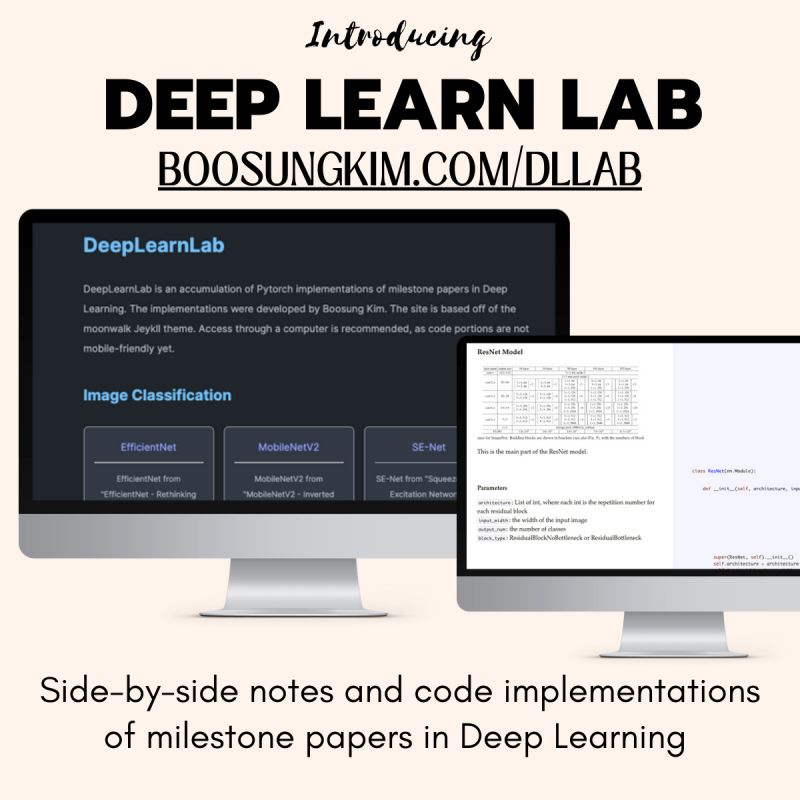

# DeepLearnLab
A learning hub for Machine Learning and Deep Learning paper implementations. Full site available at [https://boosungkim.com/dllab](https://boosungkim.com/dllab).

## About
Deep Learn Lab contains an accumulation of Pytorch implementations of popular papers and concepts. The project idea was inspired by the popular "Annotated Pytorch Paper Implementations." The paper implementation is considered "correct" and "complete" if the model behaves accordingly and produces an accuracy comparable to the experiments in the original paper.

## Current Implementations
#### Image Classification
- [VGG](https://arxiv.org/abs/1409.1556)
- [ResNet](https://arxiv.org/pdf/1512.03385)
- [DenseNet](https://arxiv.org/abs/1608.06993)
- [SE-Net](https://arxiv.org/abs/1709.01507)
- [SE-ResNet](https://arxiv.org/abs/1709.01507)
- [MobileNetV2](https://arxiv.org/pdf/1801.04381)
- [EfficientNet](https://arxiv.org/abs/1905.11946)

#### Object Detection
- Faster RCNN

#### Basic Concepts/Tools
- [Autograd](https://pytorch.org/tutorials/beginner/blitz/autograd_tutorial.html)

## Experiments
| Model                                                 | Best Training Accuracy    | Best Test Accuracy          |
| -----------------                                     | ----------------------      | ----------------------      |
| [VGG16](https://arxiv.org/abs/1409.1556)              | 93.4%                       | 88.2%                       |
| [ResNet](https://arxiv.org/pdf/1512.03385)              | 94.7%                       | 88.5%                       |
| [DenseNet](https://arxiv.org/abs/1608.06993)              | 96.6%                       | 88.7%                       |
| [SE-ResNet](https://arxiv.org/abs/1709.01507)              | 95.9%                       | 88.6%                       |

## Credits
The model code implementations were completed by Boosung Kim. The website theme is based off of [Moonwalk](https://github.com/abhinavs/moonwalk).

## License
MIT
